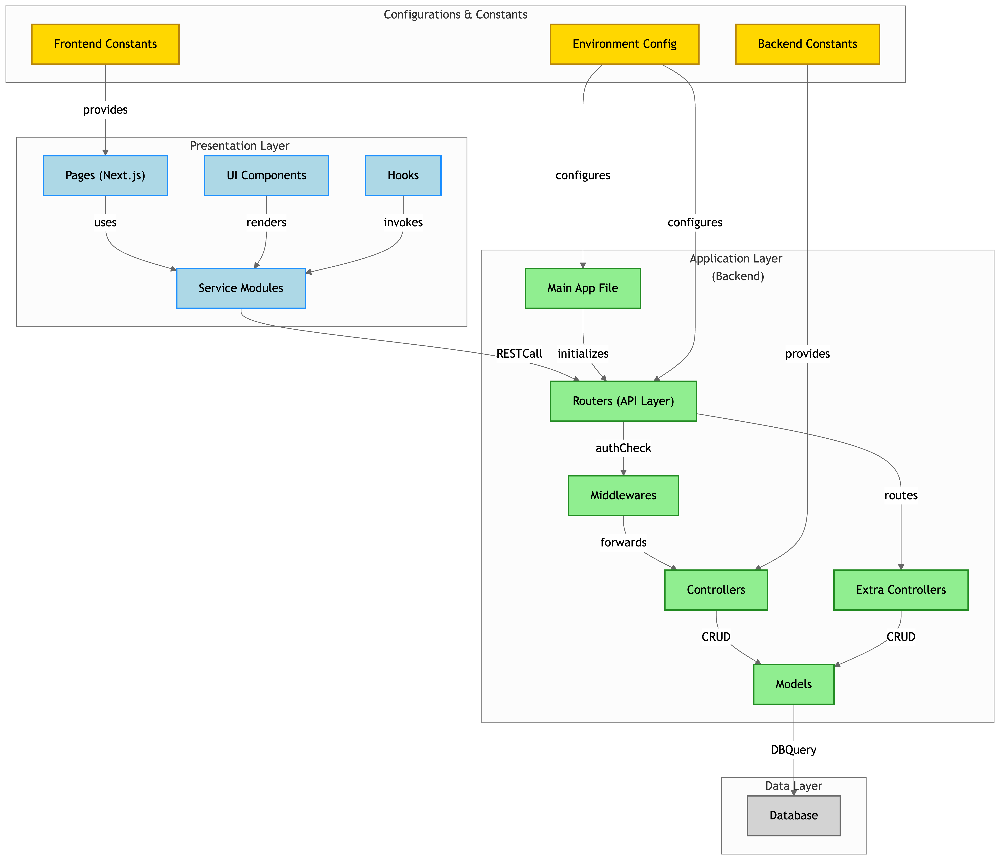

# 🏢 SMART OFFICE SOLUTIONS WEB APPLICATION

A smart, modular, and scalable office management web application designed to modernize digital operations using **React (Next.js)** and **Node.js**. This project features a clean architecture, RESTful backend, and intuitive frontend interface. Ideal for managing internal workflows and administrative tasks in a smart office ecosystem.

---

## 🧩 FEATURES

- ✅ Full-stack implementation (React + Node.js + MongoDB)
- ✅ Modular architecture with separation of concerns
- ✅ API routing, controller-based logic, middleware support
- ✅ Environment-aware configurations and constants
- ✅ Easily deployable to cloud (Render, Vercel, Railway)

---

## 🗺️ ARCHITECTURE DIAGRAM

---

## 📁 PROJECT STRUCTURE

### 🔹 Presentation Layer (Frontend)
- [Pages (Next.js)](https://github.com/akshat151/smart-office-solutions-web-application-using-react-and-node.js/tree/main/Project%20Executable/frontend/pages)
- [UI Components](https://github.com/akshat151/smart-office-solutions-web-application-using-react-and-node.js/tree/main/Project%20Executable/frontend/components)
- [Hooks](https://github.com/akshat151/smart-office-solutions-web-application-using-react-and-node.js/tree/main/Project%20Executable/frontend/hooks)
- [Service Modules](https://github.com/akshat151/smart-office-solutions-web-application-using-react-and-node.js/tree/main/Project%20Executable/frontend/services)

### 🔹 Application Layer (Backend)
- [Main App File](https://github.com/akshat151/smart-office-solutions-web-application-using-react-and-node.js/blob/main/Project%20Executable/backend/app.js)
- [Routers (API Layer)](https://github.com/akshat151/smart-office-solutions-web-application-using-react-and-node.js/tree/main/Project%20Executable/backend/routers)
- [Controllers](https://github.com/akshat151/smart-office-solutions-web-application-using-react-and-node.js/tree/main/Project%20Executable/backend/controllers)
- [Extra Controllers](https://github.com/akshat151/smart-office-solutions-web-application-using-react-and-node.js/tree/main/Project%20Executable/backend/controllers__)
- [Middlewares](https://github.com/akshat151/smart-office-solutions-web-application-using-react-and-node.js/tree/main/Project%20Executable/backend/middlewares)
- [Models](https://github.com/akshat151/smart-office-solutions-web-application-using-react-and-node.js/tree/main/Project%20Executable/backend/models)

### 🔹 Configurations & Constants
- [Environment Config (.env)](https://github.com/akshat151/smart-office-solutions-web-application-using-react-and-node.js/blob/main/Project%20Executable/backend/.env)
- [Backend Constants](https://github.com/akshat151/smart-office-solutions-web-application-using-react-and-node.js/blob/main/Project%20Executable/backend/constants.js)
- [Frontend Constants](https://github.com/akshat151/smart-office-solutions-web-application-using-react-and-node.js/tree/main/Project%20Executable/frontend/constants)

### 🔹 Data Layer
- [MongoDB / Database Models](https://github.com/akshat151/smart-office-solutions-web-application-using-react-and-node.js/tree/main/Database)

---

## 🧭 GETTING STARTED

### 🔧 LOCAL DEPLOYMENT

1. **Clone the repository**

     git clone https://github.com/akshat151/smart-office-solutions-web-application-using-react-and-node.js.git
     cd smart-office-solutions-web-application-using-react-and-node.js

2.	Backend setup

    cd "Project Executable/backend"
    npm install
    npm start

3.	Frontend setup

    cd "../frontend"
    npm install
    npm run dev

4.	Visit the app

    http://localhost:3000

---

☁️ CLOUD DEPLOYMENT (OPTIONAL)

🔹 Render (Full Stack Deployment)
	1.	Connect your GitHub repo to Render
	2.	Create a Web Service:
	•	Root directory: Project Executable/backend
	•	Start command: npm start
	•	Set environment variables: MONGODB_URI, SESSION_SECRET, etc.
	3.	Create a Static Site:
	•	Root directory: Project Executable/frontend
	•	Build command: npm run build
	•	Publish directory: .next

🔹 Vercel (Frontend Only)
	1.	Connect your repo and select the frontend/ folder
	2.	Set:
	•	Build command: npm run build
	•	Output directory: .next

🔹 Railway / Heroku (Backend Only)
	1.	Create a new project
	2.	Set environment variables
	3.	Point root to the backend/ directory
	4.	Confirm auto-deploy or manually deploy

---

📚 LICENSE

This project is licensed under the MIT License. See the LICENSE file for more details.

---

🙌 CREDITS

Created by Akshat with ❤️ for digital transformation in smart office environments.

